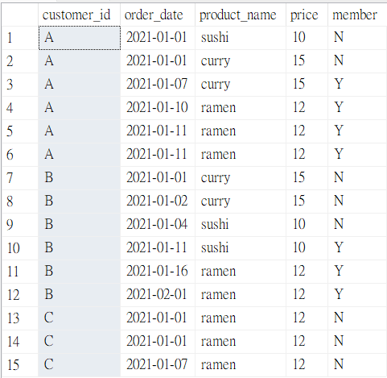
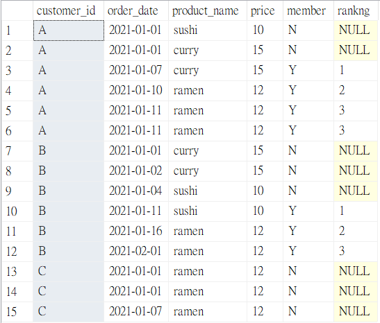

# 🥢Case Study #1: Danny's Diner - Bonus Questions and Solutions
(MS SQL Server)

### Entity Diagram


<hr>

### 1. Join all things
The following questions are related to creating basic data tables that Danny and his team can use to quickly derive insights without needing to join the underlying tables using SQL. Table should include following columns: **customer_id, order_date, product_name, price, member.**

```sql
SELECT
  sales.customer_id,
  order_date,
  product_name,
  price,
  CASE
    WHEN join_date IS NULL THEN 'N'
    WHEN order_date < join_date THEN 'N'
    ELSE 'Y'
  END AS member
FROM sales
JOIN menu ON sales.product_id = menu.product_id
LEFT JOIN members ON sales.customer_id = members.customer_id;
```
   🪄 **Output:**



<hr>

### 2. Rank all things
Danny also requires further information about the ranking of customer products, but he purposely does not need the ranking for non-member purchases so he expects null ranking values for the records when customers are not yet part of the loyalty program.

```sql
-- Step 1: Create a cte based on query 1 (Join all things)

WITH merged_table_cte AS(
  SELECT
    sales.customer_id,
    order_date,
    product_name,
    price,
    CASE
      WHEN join_date IS NULL THEN 'N'
      WHEN order_date < join_date THEN 'N'
      ELSE 'Y'
    END AS member
  FROM sales
  JOIN menu ON sales.product_id = menu.product_id
  LEFT JOIN members ON sales.customer_id = members.customer_id
  )

-- Step 2: Add column 'ranking' to show the order of items being purchased by each customer 
--         after becoming members

SELECT
  customer_id,
  order_date,
  product_name,
  price,
  member,
  CASE
    WHEN member = 'N' THEN NULL
    ELSE RANK() OVER(PARTITION BY customer_id, member ORDER BY order_date)
  END AS rankng
FROM merged_table_cte;
```
   🪄 **Output:**



<hr>
