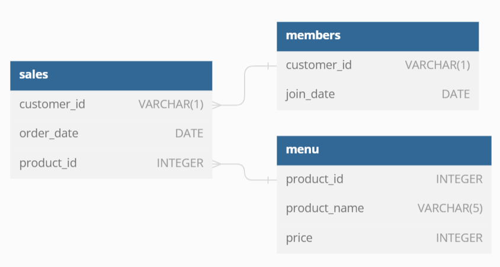

# 🥢Case Study #1: Danny's Diner - Bonus Questions and Solutions
(MS SQL Server)

### Entity Diagram



<hr>

### 1. Join all things
The following questions are related to creating basic data tables that Danny and his team can use to quickly derive insights without needing to join the underlying tables using SQL. Table should include following columns: **customer_id, order_date, product_name, price, member.**

```sql
SELECT
  sales.customer_id,
  order_date,
  product_name,
  price,
  CASE
    WHEN join_date IS NULL THEN 'N'
    WHEN order_date < join_date THEN 'N'
    ELSE 'Y'
  END AS member
FROM sales
JOIN menu ON sales.product_id = menu.product_id
LEFT JOIN members ON sales.customer_id = members.customer_id;
```

