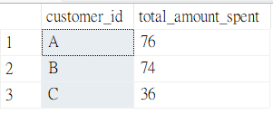

# 🥢Case Study #1: Danny's Diner - Questions and Solutions
(MS SQL Server)

### 1.	What is the total amount each customer spent at the restaurant?
```sql
SELECT
  customer_id,
  SUM(price) AS total_amount_spent
FROM sales
JOIN menu ON sales.product_id = menu.product_id
GROUP BY customer_id;
```
   **Output:**



### 2. 	How many days has each customer visited the restaurant?
```sql
SELECT
  customer_id,
  COUNT(DISTINCT order_date) AS total_visited_days
FROM sales
GROUP BY customer_id;
```
   **Output:**
   

