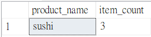
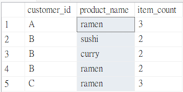
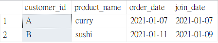
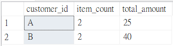
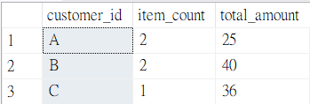

# 🥢Case Study #1: Danny's Diner - Questions and Solutions
(MS SQL Server)

### Entity Diagram


<hr>

### 1.	What is the total amount each customer spent at the restaurant?
```sql
SELECT
  customer_id,
  SUM(price) AS total_amount_spent
FROM sales
JOIN menu ON sales.product_id = menu.product_id
GROUP BY customer_id;
```
   🪄 **Output:**


<hr>

### 2. 	How many days has each customer visited the restaurant?
```sql
SELECT
  customer_id,
  COUNT(DISTINCT order_date) AS total_visited_days
FROM sales
GROUP BY customer_id;
```
   🪄 **Output:**
   


<hr>

### 3. What was the first item from the menu purchased by each customer?
There are two possible outputs using different functions as follow. The first output shows only one item that was first recorded in the system, and the latter shows all items purchased on the first purchasing date.

**(1) Only shows the first item purchased by each customer, even they bought more than one item on the first purchase date**
```sql
--I'm using ROW_NUMBER() function to get only the first item purchased by each customer

WITH item_ranked_cte AS(
  SELECT
    customer_id,
    order_date,
    product_id,
    ROW_NUMBER() OVER(PARTITION BY customer_id ORDER BY order_date) AS ranking
  FROM sales)

SELECT
  customer_id,
  product_name
FROM item_ranked_cte
JOIN menu ON item_ranked_cte.product_id = menu.product_id
WHERE ranking = 1;
```
   🪄 **Output 1:**
   


**(2) Shows all the items purchased by each customer on their first purchase date**
```sql
--I'm using RANK() function to get all items purchased by each customer on their first purchase date

WITH item_ranked_cte AS(
  SELECT
    customer_id,
    order_date,
    product_id,
    RANK() OVER(PARTITION BY customer_id ORDER BY order_date) AS ranking
  FROM sales)

SELECT
  customer_id,
  product_name
FROM item_ranked_cte
JOIN menu ON item_ranked_cte.product_id = menu.product_id
WHERE ranking = 1;
```
   🪄 **Output 2:**
   


<hr>

### 4. What is the most purchased item on the menu and how many times was it purchased by all customers?
```sql
SELECT TOP 1
  product_name, 
  COUNT(product_name) AS item_count
FROM sales
JOIN menu ON sales.product_id = menu.product_id
GROUP BY product_name
ORDER BY product_name DESC;
```
   🪄 **Output:**
   


<hr>

### 5. Which item was the most popular for each customer?
```sql
WITH popular_item_cte AS(
  SELECT
    customer_id,
    product_id,
    COUNT(product_id) AS item_count,
    RANK() OVER(PARTITION BY customer_id ORDER BY COUNT(product_id) DESC) AS ranking
  FROM sales
  GROUP BY customer_id, product_id)

SELECT
  customer_id,
  product_name,
  item_count
FROM popular_item_cte
JOIN menu ON popular_item_cte.product_id = menu.product_id
WHERE ranking = 1;
```
   🪄 **Output:**
   


<hr>

### 6. Which item was purchased first by the customer after they became a member?
```sql
WITH member_orders_cte AS(
SELECT
  sales.customer_id,
  order_date,
  join_date,
  product_id, 
  RANK() OVER(PARTITION BY sales.customer_id ORDER BY order_date) AS ranking
FROM sales
JOIN members ON sales.customer_id = members.customer_id
WHERE order_date >= join_date)

SELECT
  customer_id,
  product_name,
  order_date,
  join_date
FROM member_orders_cte
JOIN menu ON member_orders_cte.product_id = menu.product_id
WHERE ranking = 1;
```
   🪄 **Output:**
   


<hr>

### 7. Which item was purchased just before the customer became a member?
```sql
WITH nonmember_cte AS(
SELECT
  sales.customer_id,
  order_date,
  join_date,
  product_id, 
  RANK() OVER(PARTITION BY sales.customer_id ORDER BY order_date DESC) AS ranking
FROM sales
JOIN members ON sales.customer_id = members.customer_id
WHERE order_date < join_date)

SELECT
  customer_id,
  product_name,
  order_date,
  join_date
FROM nonmember_cte
JOIN menu ON nonmember_cte.product_id = menu.product_id
WHERE ranking = 1;
```
   🪄 **Output:**
   


<hr>

### 8. What are the total items and amount spent for each member before they became a member?
I provided two outputs, one output shows the results of customers who have become members, and the other one shows the results of all customers.
```sql
--Following is a query that only includes customers who are in the member list

SELECT
  sales.customer_id,
  COUNT(DISTINCT sales.product_id) AS item_count,
  SUM(price) AS total_amount
FROM sales
JOIN menu ON sales.product_id = menu.product_id
JOIN members ON sales.customer_id = members.customer_id
WHERE order_date < join_date
GROUP BY sales.customer_id;
```
   🪄 **Output 1:**
   


```sql
--Following is a query that also includes customers who are not in the member list

SELECT
  sales.customer_id,
  COUNT(DISTINCT sales.product_id) AS item_count,
  SUM(price) AS total_amount
FROM sales
JOIN menu ON sales.product_id = menu.product_id
LEFT JOIN members ON sales.customer_id = members.customer_id
WHERE order_date < join_date OR join_date IS NULL
GROUP BY sales.customer_id;
```
   🪄 **Output 2:**
   

