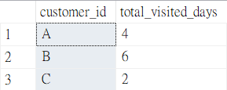
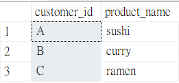

# 🥢Case Study #1: Danny's Diner - Questions and Solutions
(MS SQL Server)

### Entity Diagram


<hr>

### 1.	What is the total amount each customer spent at the restaurant?
```sql
SELECT
  customer_id,
  SUM(price) AS total_amount_spent
FROM sales
JOIN menu ON sales.product_id = menu.product_id
GROUP BY customer_id;
```
   **Output:**


<hr>

### 2. 	How many days has each customer visited the restaurant?
```sql
SELECT
  customer_id,
  COUNT(DISTINCT order_date) AS total_visited_days
FROM sales
GROUP BY customer_id;
```
   **Output:**
   


<hr>

### 3. What was the first item from the menu purchased by each customer?
There are two possible outputs using different functions as follow. The first output shows only one item that first recorded in the system, and the later shows all items purchased on the first purchasing date.

**(1) Only shows the first item purchased by each customer, even they bought more than one item on the first purchase date**
```sql
--I'm using ROW_NUMBER() function to get only the first item purchased by each customer

WITH item_ranked_cte AS(
  SELECT
    customer_id,
    order_date,
    product_id,
    ROW_NUMBER() OVER(PARTITION BY customer_id ORDER BY order_date) AS ranking
  FROM sales)

SELECT
  customer_id,
  product_name
FROM item_ranked_cte
JOIN menu ON item_ranked_cte.product_id = menu.product_id
WHERE ranking = 1;
```
   **Output 1:**
   


**(2) Shows all the items purchased by each customer on their first purchase date**
```sql
--I'm using RANK() function to get all items purchased by each customer on their first purchase date

WITH item_ranked_cte AS(
  SELECT
    customer_id,
    order_date,
    product_id,
    ROW_NUMBER() OVER(PARTITION BY customer_id ORDER BY order_date) AS ranking
  FROM sales)

SELECT
  customer_id,
  product_name
FROM item_ranked_cte
JOIN menu ON item_ranked_cte.product_id = menu.product_id
WHERE ranking = 1;
```
   **Output 1:**
   

