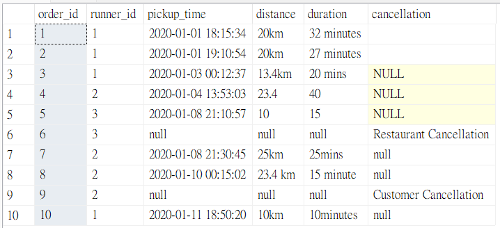
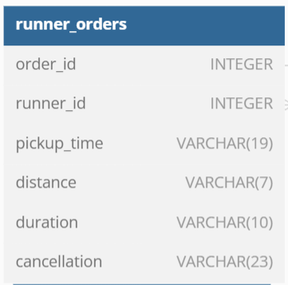
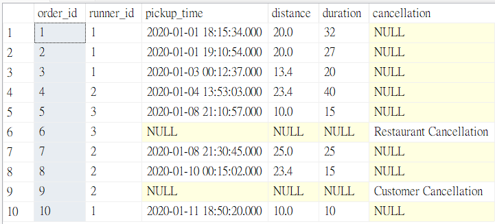
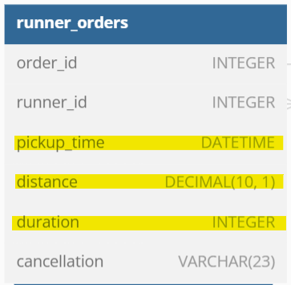
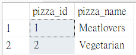
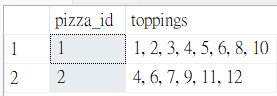
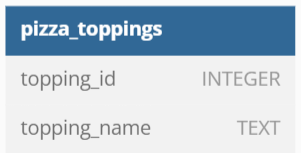

# Case Study #2: :runner:Pizza Runner - Data Cleaning
(MS SQL Server)

### Entity Diagram


 :books:Based on the tables provided by Danny, I will clean the data table by table.
  
  **However, only [table 2](#table-2-customer_orders) and [table 3](#table-3-runner_orders) were modified.**
<hr>

### Table 1: runners
| Original table | Data Type |
| :---: | :---: |
|  |  |

Nothing needs to be changed for this table.:+1:

---
### Table 2: customer_orders
| Original table | Data Type |
| :---: | :---: |
|  |  |

**Issues:** columns ```exclusions``` and ```extras``` have non-standardized null value
```sql
-- column: exclusions - standardize the NULL value

UPDATE customer_orders
SET exclusions = NULL
WHERE exclusions = '' OR exclusions = 'null';

-- column: extras - standardize the NULL value

UPDATE customer_orders
SET extras = NULL
WHERE extras = '' OR extras = 'null';
```
**Result:**
| Cleaned table | Data Type |
| :---: | :---: |
|  |  |

---
### Table 3: runner_orders
| Original table | Data Type |
| :---: | :---: |
|  |  |

**Issues:**
 1. Column ```pickup_time```'s data type should be DATETIME.
 2. The value of column ```distance``` should be standardized, and the data type should be DECIMAL for further calculations.
 3. The value of column ```duration``` should be standardized, and the data type should be INTEGER for further calculations.
 4. Column ```cancellation```'s null value should be standardized.
```sql
-- Reminder: Standardized NULL value before changing data types

-- column: pickup_time

UPDATE runner_orders
SET pickup_time = NULL
WHERE pickup_time = 'null';

ALTER TABLE runner_orders
ALTER COLUMN pickup_time DATETIME;

-- column: distance

UPDATE runner_orders
SET distance = NULL
WHERE distance = 'null';

UPDATE runner_orders
SET distance = TRIM('km ' FROM distance)
WHERE distance Like '%km';

ALTER TABLE runner_orders
ALTER COLUMN distance DECIMAL(10, 1);

-- column: duration

UPDATE runner_orders
SET duration = NULL
WHERE duration = 'null';

UPDATE runner_orders
SET duration = TRIM(' minutes' FROM duration)
WHERE duration Like '%min%';

ALTER TABLE runner_orders
ALTER COLUMN duration INTEGER;

-- column: cancellation

UPDATE runner_orders
SET cancellation = NULL
WHERE cancellation = 'null' OR cancellation = '' ;
```
**Result:**
| Cleaned table | Data Type |
| :---: | :---: |
|  |  |

---
### Table 4: pizza_names
| Original table | Data Type |
| :---: | :---: |
|  |  |

Nothing needs to be changed for this table.:+1:

---
### Table 5: pizza_recipes
| Original table | Data Type |
| :---: | :---: |
|  |  |

Nothing needs to be changed for this table.:+1:

---
### Table 6: pizza_toppings
| Original table | Data Type |
| :---: | :---: |
|  |  |

Nothing needs to be changed for this table.:+1:
