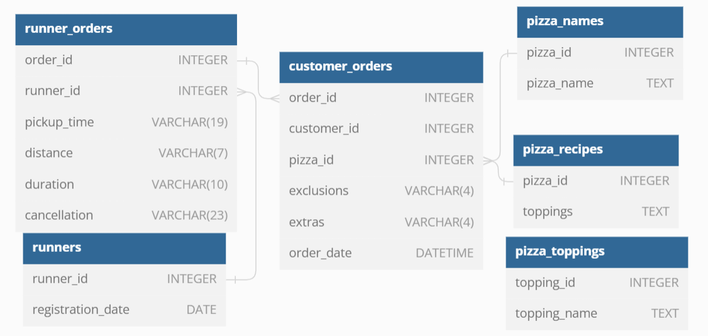
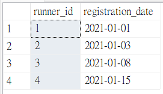
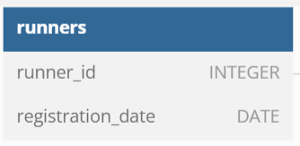
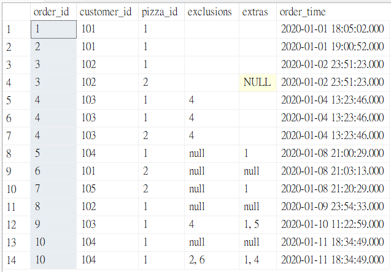
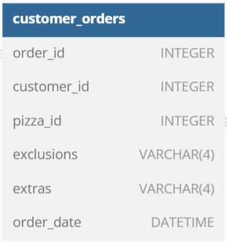

# Case Study #2: :runner:Pizza Runner - Data Cleaning
(MS SQL Server)

### Entity Diagram

 :books:Based on the tables provided by Danny, I will clean the data table by table.

### Table 1: runners
| Original table | Data Type |
| :---: | :---: |
|  |  |

Nothing needs to be changed for this table.:+1:

---
### Table 2: customer_orders
| Original table | Data Type |
| :---: | :---: |
|  |  |
