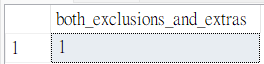

##  Case Study #2: Pizza Runner 
<h1 align='center'> 🍕 A. Pizza Metrics </h1>
(MS SQL Server)

<hr>

### 1. How many pizzas were ordered?
```sql
SELECT
  COUNT(order_id) AS total_pizzas_count
FROM customer_orders;
```
   🪄 **Output:**


<hr>

### 2. How many unique customer orders were made?
```sql
SELECT
  COUNT(DISTINCT order_id) AS total_orders_count
FROM customer_orders;
```
   🪄 **Output:**
   


<hr>

### 3. How many successful orders were delivered by each runner?
```sql
SELECT
  runner_id,
  COUNT(order_id) AS delivered_orders
FROM runner_orders
WHERE cancellation IS NULL
GROUP BY runner_id;
```
   🪄 **Output:**
   


<hr>

### 4. How many of each type of pizza was delivered?
```sql
WITH delivered_cte AS(
  SELECT
    pizza_id,
    COUNT(pizza_id) AS delivered_count
  FROM customer_orders AS co
  JOIN runner_orders AS ro ON co.order_id = ro.order_id
  WHERE cancellation IS NULL
  GROUP BY pizza_id
	)

SELECT
  pizza_name,
  delivered_count
FROM delivered_cte AS d
JOIN pizza_names AS p ON d.pizza_id = p.pizza_id;
```
   🪄 **Output:**
   


<hr>

### 5. How many Vegetarian and Meatlovers were ordered by each customer?
```sql
WITH distribution_cte AS(
  SELECT
    customer_id,
    pizza_id,
    COUNT(pizza_id) AS order_count
  FROM customer_orders
  GROUP BY customer_id, pizza_id
  )

SELECT
  pizza_name,
  customer_id,
  order_count
FROM distribution_cte AS d
JOIN pizza_names AS p ON d.pizza_id = p.pizza_id;
```
   🪄 **Output:**
   


<hr>

### 6. What was the maximum number of pizzas delivered in a single order?
```sql
SELECT TOP 1
  COUNT(co.order_id) AS pizzas_count
FROM customer_orders AS co
JOIN runner_orders AS ro ON co.order_id = ro.order_id
WHERE cancellation IS NULL
GROUP BY co.order_id 
ORDER BY pizzas_count DESC;
```
   🪄 **Output:**
   


<hr>

### 7. For each customer, how many delivered pizzas had at least 1 change and how many had no changes?
```sql
WITH changes_cte AS(
  SELECT
    customer_id,
    CASE
    	WHEN exclusions IS NULL AND extras IS NULL THEN 0
	ELSE 1
    END AS changes,
    CASE
    	WHEN exclusions IS NULL AND extras IS NULL THEN 1
	ELSE 0
    END AS no_changes
  FROM customer_orders AS co
  JOIN runner_orders AS ro ON co.order_id = ro.order_id
  WHERE cancellation IS NULL
  )

SELECT
  customer_id,
  SUM(changes) AS customized,
  SUM(no_changes) AS unchanged
FROM changes_cte
GROUP BY customer_id;
```
   🪄 **Output:**
   


<hr>

### 8. How many pizzas were delivered that had both exclusions and extras?
```sql
SELECT
  COUNT(pizza_id) AS both_exclusions_and_extras
FROM customer_orders AS co
JOIN runner_orders AS ro ON co.order_id = ro.order_id
WHERE cancellation IS NULL 
  AND exclusions IS NOT NULL
  AND extras IS NOT NULL;
```
   🪄 **Output:**
   


<hr>

### 9. What was the total volume of pizzas ordered for each hour of the day?
```sql
SELECT
  DATEPART(hour,order_time) AS hour_time,
  COUNT(order_id) AS total_orders
FROM customer_orders
GROUP BY DATEPART(hour,order_time)
ORDER BY DATEPART(hour,order_time);
```
   🪄 **Output:**
   


<hr>

### 10. What was the volume of orders for each day of the week?
```sql
WITH member_points_cte AS(
  SELECT
    sales.customer_id,
    CASE
      WHEN product_name = 'sushi' THEN price*20
      WHEN order_date BETWEEN join_date AND DATEADD(day, 6, join_date) THEN price*20
      ELSE price*10
    END AS points
  FROM sales
  JOIN menu ON sales.product_id = menu.product_id
  JOIN members ON sales.customer_id = members.customer_id
  WHERE order_date < '2021-02-01'
  )

SELECT
  customer_id,
  SUM(points) AS total_points
FROM member_points_cte
GROUP BY customer_id;
```
   🪄 **Output:**
   


<hr>

👉[Click to see bonus questions and solutions](Bonus_questions_solutions.md)
