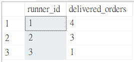

##  Case Study #2: Pizza Runner 
<h1 align='center'> 🍕 A. Pizza Metrics </h1>
(MS SQL Server)

<hr>

### 1. How many pizzas were ordered?
```sql
SELECT
  COUNT(order_id) AS total_pizzas_count
FROM customer_orders;
```
   🪄 **Output:**


<hr>

### 2. How many unique customer orders were made?
```sql
SELECT
  COUNT(DISTINCT order_id) AS total_orders_count
FROM customer_orders;
```
   🪄 **Output:**
   


<hr>

### 3. How many successful orders were delivered by each runner?
```sql
SELECT
  runner_id,
  COUNT(order_id) AS delivered_orders
FROM runner_orders
WHERE cancellation IS NULL
GROUP BY runner_id;
```
   🪄 **Output:**
   


<hr>

### 4. How many of each type of pizza was delivered?
```sql
WITH delivered_cte AS(
	SELECT
		pizza_id,
		COUNT(pizza_id) AS delivered_count
	FROM customer_orders AS co
	JOIN runner_orders AS ro ON co.order_id = ro.order_id
	WHERE cancellation IS NULL
	GROUP BY pizza_id
	)

SELECT
  pizza_name,
  delivered_count
FROM delivered_cte AS d
JOIN pizza_names AS p ON d.pizza_id = p.pizza_id;
```
   🪄 **Output:**
   


<hr>

### 5. How many Vegetarian and Meatlovers were ordered by each customer?
```sql
WITH distribution_cte AS(
  SELECT
    customer_id,
    pizza_id,
    COUNT(pizza_id) AS order_count
  FROM customer_orders
  GROUP BY customer_id, pizza_id
  )

SELECT
  pizza_name,
  customer_id,
  order_count
FROM distribution_cte AS d
JOIN pizza_names AS p ON d.pizza_id = p.pizza_id;
```
   🪄 **Output:**
   


<hr>

### 6. What was the maximum number of pizzas delivered in a single order?
```sql
SELECT TOP 1
  COUNT(co.order_id) AS pizzas_count
FROM customer_orders AS co
JOIN runner_orders AS ro ON co.order_id = ro.order_id
WHERE cancellation IS NULL
GROUP BY co.order_id 
ORDER BY pizzas_count DESC;
```
   🪄 **Output:**
   


<hr>

### 7. For each customer, how many delivered pizzas had at least 1 change and how many had no changes?
```sql
WITH nonmember_cte AS(
  SELECT
    sales.customer_id,
    order_date,
    join_date,
    product_id, 
    RANK() OVER(PARTITION BY sales.customer_id ORDER BY order_date DESC) AS ranking
  FROM sales
  JOIN members ON sales.customer_id = members.customer_id
  WHERE order_date < join_date
  )

SELECT
  customer_id,
  product_name,
  order_date,
  join_date
FROM nonmember_cte
JOIN menu ON nonmember_cte.product_id = menu.product_id
WHERE ranking = 1;
```
   🪄 **Output:**
   


<hr>

### 8. How many pizzas were delivered that had both exclusions and extras?
I provided two outputs, one output shows the results of customers who have become members, and the other one shows the results of all customers.
```sql
--Following is a query that only includes customers who are in the member list

SELECT
  sales.customer_id,
  COUNT(DISTINCT sales.product_id) AS item_count,
  SUM(price) AS total_amount
FROM sales
JOIN menu ON sales.product_id = menu.product_id
JOIN members ON sales.customer_id = members.customer_id
WHERE order_date < join_date
GROUP BY sales.customer_id;
```
   🪄 **Output 1:**
   


```sql
--Following is a query that also includes customers who are not in the member list

SELECT
  sales.customer_id,
  COUNT(DISTINCT sales.product_id) AS item_count,
  SUM(price) AS total_amount
FROM sales
JOIN menu ON sales.product_id = menu.product_id
LEFT JOIN members ON sales.customer_id = members.customer_id
WHERE order_date < join_date OR join_date IS NULL
GROUP BY sales.customer_id;
```
   🪄 **Output 2:**
   


<hr>

### 9. What was the total volume of pizzas ordered for each hour of the day?
```sql
WITH points_cte AS(
  SELECT
    customer_id,
    CASE
      WHEN product_name = 'sushi' THEN price*20
      ELSE price*10
    END AS points
  FROM sales
  JOIN menu ON sales.product_id = menu.product_id
  )

SELECT
  customer_id,
  SUM(points) AS total_points
FROM points_cte
GROUP BY customer_id;
```
   🪄 **Output:**
   


<hr>

### 10. What was the volume of orders for each day of the week?
```sql
WITH member_points_cte AS(
  SELECT
    sales.customer_id,
    CASE
      WHEN product_name = 'sushi' THEN price*20
      WHEN order_date BETWEEN join_date AND DATEADD(day, 6, join_date) THEN price*20
      ELSE price*10
    END AS points
  FROM sales
  JOIN menu ON sales.product_id = menu.product_id
  JOIN members ON sales.customer_id = members.customer_id
  WHERE order_date < '2021-02-01'
  )

SELECT
  customer_id,
  SUM(points) AS total_points
FROM member_points_cte
GROUP BY customer_id;
```
   🪄 **Output:**
   


<hr>

👉[Click to see bonus questions and solutions](Bonus_questions_solutions.md)
