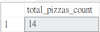
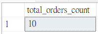
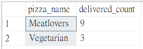
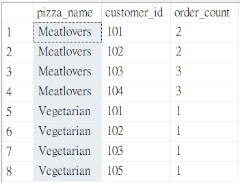
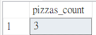
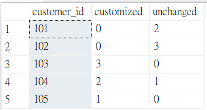
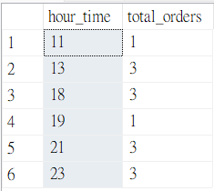

##  Case Study #2: Pizza Runner 
<h1 align='center'> 🍕 A. Pizza Metrics </h1>
(MS SQL Server)

<hr>

### 1. How many pizzas were ordered?
```sql
SELECT
  COUNT(order_id) AS total_pizzas_count
FROM customer_orders;
```
   🪄 **Output:**



<hr>

### 2. How many unique customer orders were made?
```sql
SELECT
  COUNT(DISTINCT order_id) AS total_orders_count
FROM customer_orders;
```
   🪄 **Output:**
   


<hr>

### 3. How many successful orders were delivered by each runner?
There are two possible outputs using different functions as follow. The first output shows only one item that was first recorded in the system, and the latter shows all items purchased on the first purchasing date.

**(1) Only shows the first item purchased by each customer, even they bought more than one item on the first purchase date**
```sql
--I'm using ROW_NUMBER() function to get only the first item purchased by each customer

WITH item_ranked_cte AS(
  SELECT
    customer_id,
    order_date,
    product_id,
    ROW_NUMBER() OVER(PARTITION BY customer_id ORDER BY order_date) AS ranking
  FROM sales
  )

SELECT
  customer_id,
  product_name
FROM item_ranked_cte
JOIN menu ON item_ranked_cte.product_id = menu.product_id
WHERE ranking = 1;
```
   🪄 **Output 1:**
   


**(2) Shows all the items purchased by each customer on their first purchase date**
```sql
--I'm using RANK() function to get all items purchased by each customer on their first purchase date

WITH item_ranked_cte AS(
  SELECT
    customer_id,
    order_date,
    product_id,
    RANK() OVER(PARTITION BY customer_id ORDER BY order_date) AS ranking
  FROM sales
  )

SELECT
  customer_id,
  product_name
FROM item_ranked_cte
JOIN menu ON item_ranked_cte.product_id = menu.product_id
WHERE ranking = 1;
```
   🪄 **Output 2:**
   


<hr>

### 4. How many of each type of pizza was delivered?
```sql
SELECT TOP 1
  product_name, 
  COUNT(product_name) AS item_count
FROM sales
JOIN menu ON sales.product_id = menu.product_id
GROUP BY product_name
ORDER BY product_name DESC;
```
   🪄 **Output:**
   


<hr>

### 5. How many Vegetarian and Meatlovers were ordered by each customer?
```sql
WITH popular_item_cte AS(
  SELECT
    customer_id,
    product_id,
    COUNT(product_id) AS item_count,
    RANK() OVER(PARTITION BY customer_id ORDER BY COUNT(product_id) DESC) AS ranking
  FROM sales
  GROUP BY customer_id, product_id
  )

SELECT
  customer_id,
  product_name,
  item_count
FROM popular_item_cte
JOIN menu ON popular_item_cte.product_id = menu.product_id
WHERE ranking = 1;
```
   🪄 **Output:**
   


<hr>

### 6. What was the maximum number of pizzas delivered in a single order?
```sql
WITH member_orders_cte AS(
  SELECT
    sales.customer_id,
    order_date,
    join_date,
    product_id, 
    RANK() OVER(PARTITION BY sales.customer_id ORDER BY order_date) AS ranking
  FROM sales
  JOIN members ON sales.customer_id = members.customer_id
  WHERE order_date >= join_date
  )

SELECT
  customer_id,
  product_name,
  order_date,
  join_date
FROM member_orders_cte
JOIN menu ON member_orders_cte.product_id = menu.product_id
WHERE ranking = 1;
```
   🪄 **Output:**
   


<hr>

### 7. For each customer, how many delivered pizzas had at least 1 change and how many had no changes?
```sql
WITH nonmember_cte AS(
  SELECT
    sales.customer_id,
    order_date,
    join_date,
    product_id, 
    RANK() OVER(PARTITION BY sales.customer_id ORDER BY order_date DESC) AS ranking
  FROM sales
  JOIN members ON sales.customer_id = members.customer_id
  WHERE order_date < join_date
  )

SELECT
  customer_id,
  product_name,
  order_date,
  join_date
FROM nonmember_cte
JOIN menu ON nonmember_cte.product_id = menu.product_id
WHERE ranking = 1;
```
   🪄 **Output:**
   


<hr>

### 8. How many pizzas were delivered that had both exclusions and extras?
I provided two outputs, one output shows the results of customers who have become members, and the other one shows the results of all customers.
```sql
--Following is a query that only includes customers who are in the member list

SELECT
  sales.customer_id,
  COUNT(DISTINCT sales.product_id) AS item_count,
  SUM(price) AS total_amount
FROM sales
JOIN menu ON sales.product_id = menu.product_id
JOIN members ON sales.customer_id = members.customer_id
WHERE order_date < join_date
GROUP BY sales.customer_id;
```
   🪄 **Output 1:**
   


```sql
--Following is a query that also includes customers who are not in the member list

SELECT
  sales.customer_id,
  COUNT(DISTINCT sales.product_id) AS item_count,
  SUM(price) AS total_amount
FROM sales
JOIN menu ON sales.product_id = menu.product_id
LEFT JOIN members ON sales.customer_id = members.customer_id
WHERE order_date < join_date OR join_date IS NULL
GROUP BY sales.customer_id;
```
   🪄 **Output 2:**
   


<hr>

### 9. What was the total volume of pizzas ordered for each hour of the day?
```sql
WITH points_cte AS(
  SELECT
    customer_id,
    CASE
      WHEN product_name = 'sushi' THEN price*20
      ELSE price*10
    END AS points
  FROM sales
  JOIN menu ON sales.product_id = menu.product_id
  )

SELECT
  customer_id,
  SUM(points) AS total_points
FROM points_cte
GROUP BY customer_id;
```
   🪄 **Output:**
   


<hr>

### 10. What was the volume of orders for each day of the week?
```sql
WITH member_points_cte AS(
  SELECT
    sales.customer_id,
    CASE
      WHEN product_name = 'sushi' THEN price*20
      WHEN order_date BETWEEN join_date AND DATEADD(day, 6, join_date) THEN price*20
      ELSE price*10
    END AS points
  FROM sales
  JOIN menu ON sales.product_id = menu.product_id
  JOIN members ON sales.customer_id = members.customer_id
  WHERE order_date < '2021-02-01'
  )

SELECT
  customer_id,
  SUM(points) AS total_points
FROM member_points_cte
GROUP BY customer_id;
```
   🪄 **Output:**
   


<hr>

👉[Click to see bonus questions and solutions](Bonus_questions_solutions.md)
