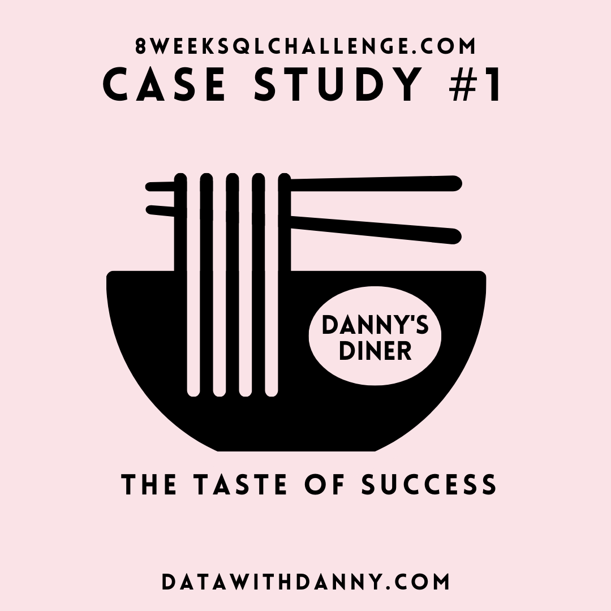

# 8_Week_SQL_Challenge :muscle:
This repository will keep track of my progress on how I use Microsoft SQL Server to solve case studies from [#8WeekSQLChallenge](https://8weeksqlchallenge.com/) created by [Danny Ma](https://www.datawithdanny.com/).
I want to thank Danny Ma for providing these excellent case studies that have been extremely helpful to me as I learn SQL skills.

## [Case Study 1 - Danny's Diner](https://github.com/Manyu-Ku/8_Week_SQL_Challenge/tree/main/Case_study%231)

## [Case Study 2 - Pizza Runner]()

More cases will be added in the future :rocket:
